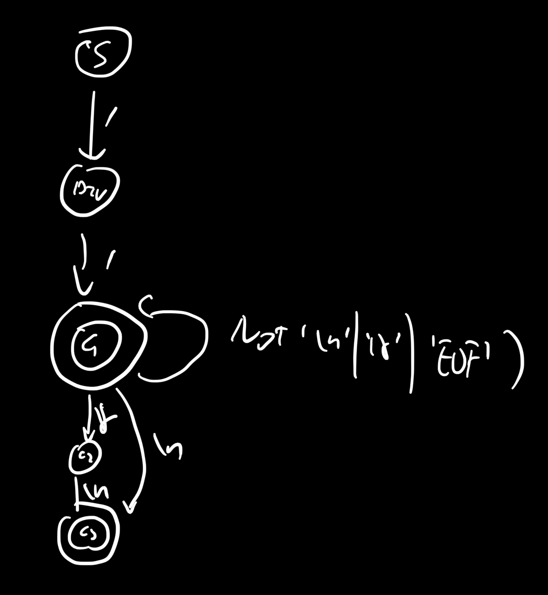

# Documentation

## Plan

### Overall

1. Draw the DFA
2. Structure of the Lexer class
3. Structure of the Token class
4. add different states to the Lexer
   1. add tests to the state to be implemented
   2. implement the sate
   3. add additional functions if needed(e.g. `getStringValue()`, if implementing the String token)

### time

Due: Sep. 15, 8 am

| time | task         | assignee |
| ---- | ------------ | -------- |
| 9.3  | plan 1, 2, 3 | Yuqi     |
|      |              |          |
|      |              |          |

# DFA

